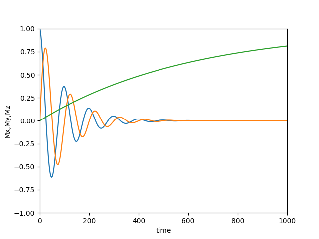
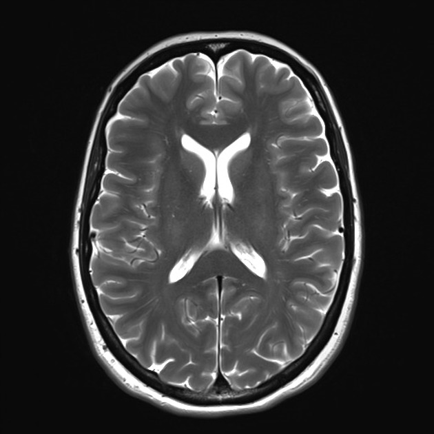
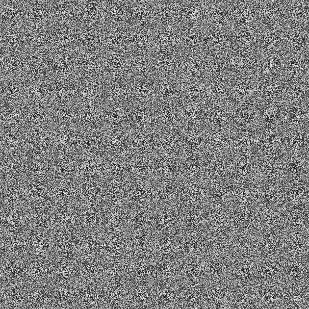
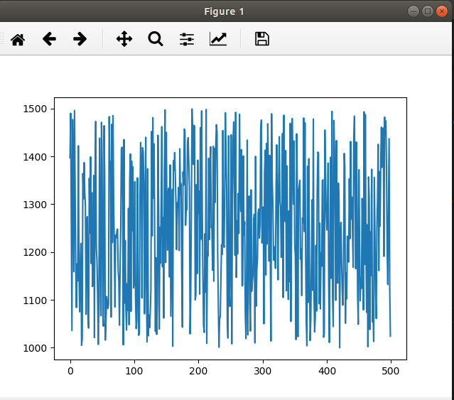

# Team members
## Reham Abdelfatah
## Renad Taher
## Nancy Salah 
## Gehad Mohammed

# Rotation  of the bulk magnetization vector
## Code:
import numpy as np 
import matplotlib.pyplot as plt 
import math 
import time 
import pylab 
dT = 1	 
T = 1000 
df = 10 
T1 = 600 
T2 = 100 
N = math.ceil(T/dT)+1 
result=[None]*2 
def freepression(T,T1,T2,df): 
  phi = 2*math.pi*df*T/1000 
  Rz = [[math.cos(phi), -math.sin(phi), 0],
      [math.sin(phi), math.cos(phi) ,0],
      [0, 0, 1]] 
  E1 = math.exp(-T/T1)	 
  E2 = math.exp(-T/T2) 
  B = [0, 0, 1-E1] 
  A = [[E2, 0, 0],
       [0 ,E2, 0],
       [0, 0 ,E1]] 
  resultA = np.dot(A,Rz) 
  return (resultA,B	) 
def decay(): 
  A,B = freepression(dT,T1,T2,df) 
  M = np.zeros((N,3)) 
  M[0,:]= np.array([1,0,0]) 
  for i in range (1,N): 
    M[i,:] = np.dot(A,M[i-1,:]) + B 
  return (M) 
M = decay() 
pylab.subplot(111) 
timedata = np.arange(N) 
axes = pylab.gca() 
axes.set_xlim(0,1000) 
axes.set_xlabel("time") 
axes.set_ylim(-1,1) 
axes.set_ylabel("Mx,My,Mz") 
Mx = M[:,0] 
My = M[:,1] 
Mz = M[:,2] 
plt.plot(timedata,Mx) 
plt.plot(timedata,My) 
plt.plot(timedata,Mz) 
plt.show() 
## Results :

# Bulk magnetization’s trajectory
### The vector is in the Mxy plane and start decaying and increases in Mz direction 
## Code:
import numpy as np 
import matplotlib.pyplot as plt 
import math 
import time 
import pylab 
dT = 1	 
T = 1000 
df = 10 
T1 = 600 
T2 = 100 
N = math.ceil(T/dT)+1 
result=[None]*2 
def freepression(T,T1,T2,df): 
  phi = 2*math.pi*df*T/1000 
  Rz = [[math.cos(phi), -math.sin(phi), 0],
      [math.sin(phi), math.cos(phi) ,0],
      [0, 0, 1]] 
  E1 = math.exp(-T/T1)	 
  E2 = math.exp(-T/T2) 
  B = [0, 0, 1-E1] 
  A = [[E2, 0, 0],
       [0 ,E2, 0],
       [0, 0 ,E1]]  
  resultA = np.dot(A,Rz) 
  return (resultA,B	) 
#resultA,B = freepression(T,T1,T2,df) 
def decay(): 
  A,B = freepression(dT,T1,T2,df) 
  M = np.zeros((N,3)) 
  M[0,:]= np.array([1,0,0]) 
  for i in range (1,N):  
    M[i,:] = np.dot(A,M[i-1,:]) + B  
  return (M) 
M = decay() 
pylab.subplot(111) 
xdata = [] 
ydata = [] 
timedata = np.arange(N) 
axes = pylab.gca() 
axes.set_xlim(-10,10) 
axes.set_ylim(-10,10) 
line,=axes.plot(xdata,ydata,'r-') 
for i in range(N) : 
  xdata.append(M[i,0]) 
  ydata.append(M[i,1]) 
  line.set_xdata(xdata) 
  line.set_ydata(ydata) 
  plt.draw() 
  plt.pause(1e-17) 
  time.sleep(0.01) 
plt.show()  

## Results :

# Fourier transform of an image
## Code:

import numpy as np  
from PIL import Image  
image = Image.open('mri.jpeg') 
#image.show()  <!--- if you want to display the real image remove the # -->
imgByte = np.asarray(image) 
ft = np.fft.fft2(imgByte) 
Ift = ft.astype(np.uint8) 
imageft = Image.fromarray(Ift).save('ft.jpg') 
fourir = Image.open('ft.jpg') 
fourir.show() 

## Results :
### The real image:

### The fourier result:

# The non-uniformity effect
### This graph shows random distrbution of bo along human body in z direction using mri of 1.5 Tesla
## code :
from random import shuffle 
import matplotlib.pyplot as plt 
RandomList = [[i] for i in range(1000,1500)]  
shuffle (RandomList) 
plt.plot(RandomList) 
plt.show() 
## Results:
 <!--- where the scale is mT --> 

